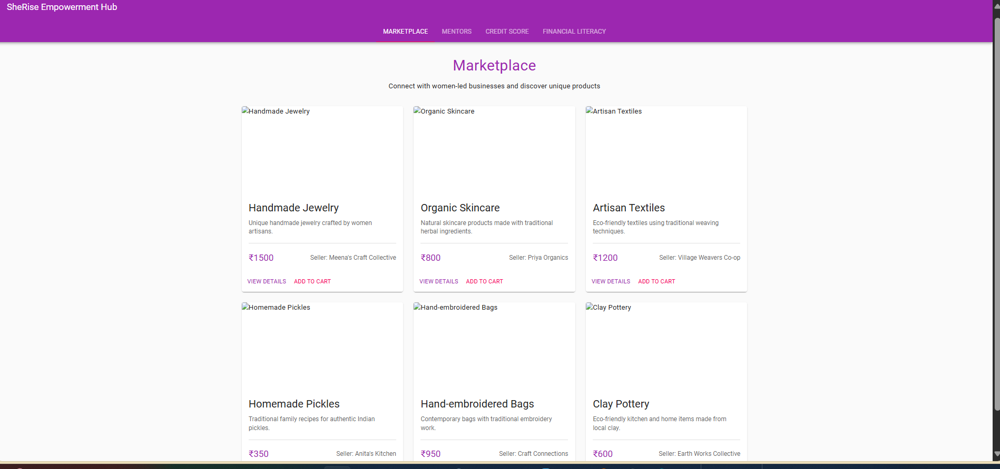
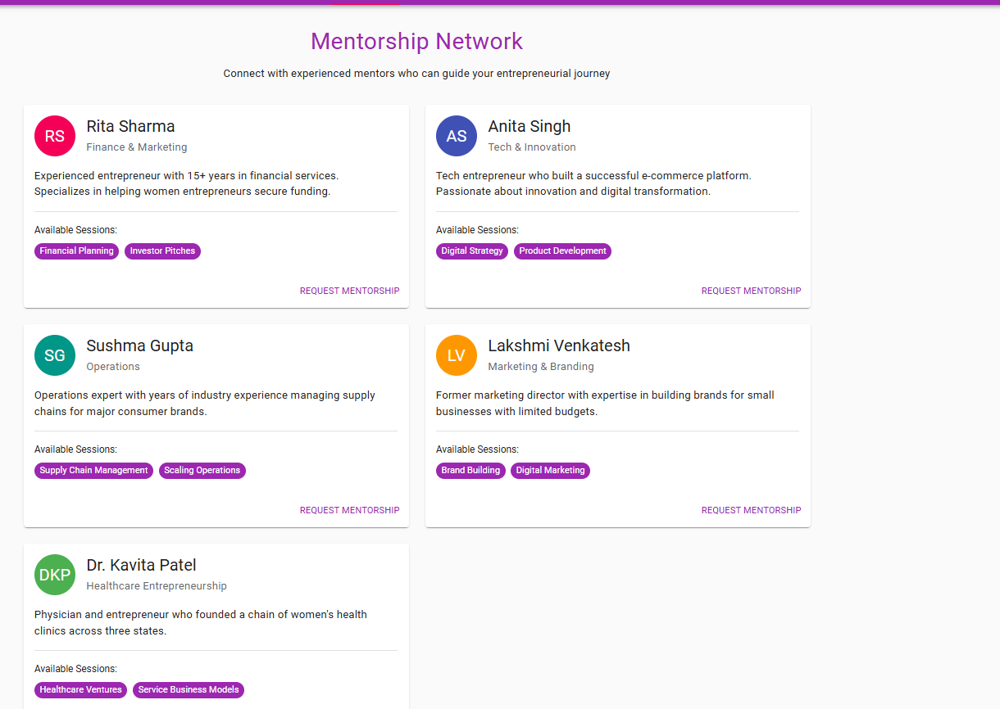
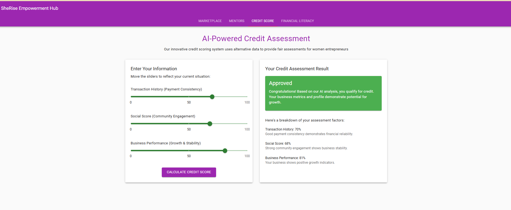
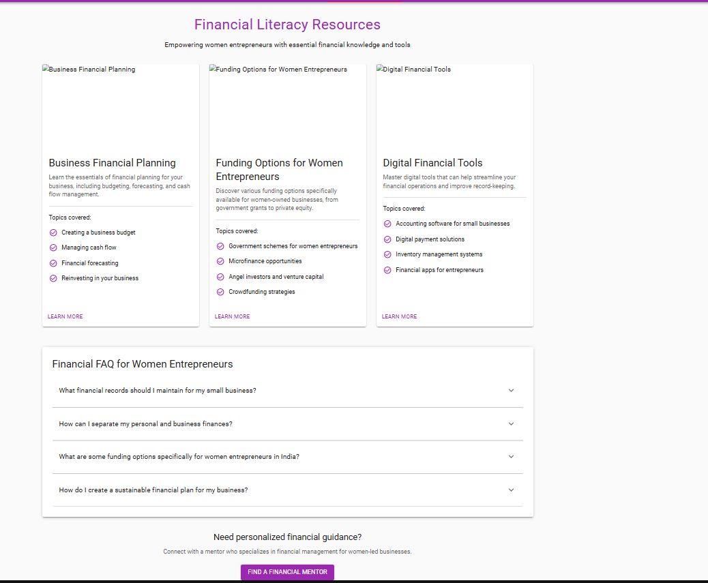

# SheRise Empowerment Hub

SheRise is a comprehensive platform designed to empower women entrepreneurs through innovative solutions. This project integrates three core modules:

- **Access to Finance:** An AI-powered credit scoring system that leverages alternative data for fair credit evaluation.
- **Market Linkages:** A digital marketplace that connects women-led businesses with customers and supply chains.
- **Mentorship:** A platform that connects emerging women entrepreneurs with experienced mentors.

The project consists of:
- A **React frontend** built with Vite and Material UI (located in the **she-rise-client/** folder),
- A **Flask backend** exposing REST API endpoints (located in the **server/** folder),
- An **AI module** for credit scoring (located in the **ai/** folder),
- A **demo data generator** (located in the **database/** folder).

---

## Application Screenshots

### Marketplace

*Digital marketplace connecting women-led businesses with customers*

### Mentorship Network

*Platform connecting emerging women entrepreneurs with experienced mentors*

### Credit Scoring

*AI-powered alternative credit assessment system*

### Financial Literacy

*Educational resources to improve financial knowledge and skills*

---

## Project Structure

```plaintext
she-rise/
├── she-rise-client/         # React Frontend
│   ├── public/
│   │   ├── index.html
│   │   ├── favicon.ico
│   │   └── assets/          # Static assets
│   │       └── images/
│   ├── src/
│   │   ├── components/
│   │   │   ├── Marketplace.jsx
│   │   │   ├── MentorList.jsx
│   │   │   ├── CreditScore.jsx
│   │   │   ├── FinancialLiteracy.jsx
│   │   │   ├── common/
│   │   │   │   ├── Header.jsx
│   │   │   │   ├── Footer.jsx
│   │   │   │   └── ProductCard.jsx
│   │   │   └── ui/
│   │   │       ├── Button.jsx
│   │   │       └── Card.jsx
│   │   ├── hooks/
│   │   │   └── useAxios.js
│   │   ├── services/
│   │   │   ├── api.js
│   │   │   └── auth.js
│   │   ├── context/
│   │   │   └── AppContext.jsx
│   │   ├── styles/
│   │   │   └── index.css
│   │   ├── App.jsx
│   │   ├── main.jsx
│   │   └── index.css
│   ├── package.json
│   ├── vite.config.js
│   └── README.md
├── server/                  # Flask Backend
│   ├── app.py               # Main application entry
│   ├── config.py            # Configuration settings
│   ├── wsgi.py              # For production deployment
│   ├── routes/
│   │   ├── __init__.py
│   │   ├── credit.py        # Credit scoring endpoints
│   │   ├── marketplace.py   # Marketplace endpoints
│   │   └── mentorship.py    # Mentorship endpoints
│   ├── services/
│   │   ├── __init__.py
│   │   └── ai_service.py    # AI model integration service
│   ├── utils/
│   │   ├── __init__.py
│   │   └── helpers.py       # Common utility functions
│   └── tests/
│       ├── __init__.py
│       ├── test_credit.py
│       ├── test_marketplace.py
│       └── test_mentorship.py
├── ai/                      # AI Module for Credit Scoring
│   ├── credit_scoring.py    # Model training script
│   ├── credit_model.pkl     # Serialized trained model
│   ├── model_evaluation.py  # Script to evaluate model performance
│   └── data_preprocessing.py # Data prep utilities
├── database/                # Demo Data Generation
│   ├── generate_demo_data.py # Script to generate test data
│   ├── credit_data.csv      # Generated credit scoring data
│   ├── products_data.csv    # Generated marketplace data
│   └── mentors_data.csv     # Generated mentorship data
├── docs/                    # Documentation
│   ├── api_docs.md          # API documentation
│   ├── setup_guide.md       # Setup instructions
│   └── architecture.md      # System architecture overview
├── images/                  # Application screenshots
│   ├── creditscore.png      # Credit scoring module screenshot
│   ├── financial.png        # Financial literacy module screenshot  
│   ├── marketplace.png      # Marketplace module screenshot
│   └── mentorship.png       # Mentorship module screenshot
├── scripts/                 # Utility scripts
│   ├── setup.sh             # Setup script
│   └── deploy.sh            # Deployment script
├── .gitignore
├── README.md                # Project overview
└── requirements.txt         # Python dependencies
```
---

## Features

- **React Frontend (Vite + Material UI):**
  - Responsive UI to display marketplace products and mentor profiles.
  - Communicates with the backend APIs via Axios.
  
- **Flask Backend:**
  - Serves API endpoints for credit scoring, marketplace data, and mentorship data.
  - Modular design using Blueprints.
  
- **AI Module:**
  - Trains a RandomForest model on demo data for credit scoring.
  - Uses alternative data such as transaction history, social score, and business performance.
  
- **Demo Data Generator:**
  - Generates synthetic credit data for training and testing the AI model.

---

## Setup Instructions

### Prerequisites

- **Python 3.11** is recommended (for compatibility with all dependencies).
- **Node.js** (for running the React frontend).

---

### Backend Setup

1. **Clone the Repository:**
   ```bash
   git clone <repository_url>
   cd she-rise
   ```

2. **Set Up a Python Virtual Environment with Python 3.11 or 3.12:**
   - For Python 3.11:
     ```bash
     py -3.11 -m venv venv
     ```
   - For Python 3.12:
     ```bash
     py -3.12 -m venv venv
     ```

3. **Activate the Virtual Environment:**
   - On **PowerShell**:
     ```powershell
     .\venv\Scripts\Activate.ps1
     ```
   - On **Command Prompt (CMD)**:
     ```cmd
     venv\Scripts\activate.bat
     ```

4. **Upgrade pip, setuptools, and wheel:**
   ```bash
   python -m pip install --upgrade pip setuptools wheel
   ```

5. **Install Python Dependencies:**
   ```bash
   pip install -r requirements.txt
   ```

> ⚠️ **Note for Python 3.12 Users:** If you encounter build errors like:
> ```
> error: Microsoft Visual C++ 14.0 or greater is required
> ```
> You need to install the required C++ build tools:
>
> - Download from: https://visualstudio.microsoft.com/visual-cpp-build-tools/
> - In the installer, check **C++ Build Tools**, and ensure the following components are selected:
>   - MSVC v143
>   - Windows 10/11 SDK
>   - CMake tools (optional)
>
> Once installed, re-run:
> ```bash
> pip install --upgrade pip setuptools wheel
> pip install -r requirements.txt
> ```

6. **Generate Demo Data:**
   ```bash
   cd database
   python generate_demo_data.py
   cd ..
   ```

7. **Train the AI Model:**
   ```bash
   cd ai
   python credit_scoring.py
   cd ..
   ```

8. **Start the Flask Backend Server:**
   ```bash
   cd server
   python app.py
   ```
   The Flask server will run at [http://127.0.0.1:5000](http://127.0.0.1:5000).

---

### Frontend Setup

1. **Navigate to the Frontend Folder:**
   ```bash
   cd she-rise-client
   ```

2. **Install Node Dependencies:**
   ```bash
   npm install
   ```

3. **Start the Vite Development Server:**
   ```bash
   npm run dev
   ```
   The app will typically be available at [http://localhost:3000](http://localhost:3000).

---

## API Endpoints

- **Credit Scoring:**  
  `POST http://127.0.0.1:5000/api/credit/score`  
  *Expects JSON data with keys: `transaction_history`, `social_score`, and `business_performance`.*

- **Marketplace Products:**  
  `GET http://127.0.0.1:5000/api/marketplace/products`

- **Mentor List:**  
  `GET http://127.0.0.1:5000/api/mentorship/mentors`

---

## Usage Overview

1. **Credit Scoring:**  
   Send financial data to the `/api/credit/score` endpoint to receive a credit approval decision.

2. **Marketplace:**  
   Browse the products from the `/api/marketplace/products` endpoint displayed in the React UI.

3. **Mentorship:**  
   View mentor profiles from the `/api/mentorship/mentors` endpoint in the React UI.

---

## Technologies Used

- **Frontend:** React, Vite, Material UI, Axios
- **Backend:** Flask, Python
- **AI & Data:** scikit-learn, pandas, joblib
- **Data Generation:** NumPy, pandas

---

## License

[Include your License Information Here]

---

## Acknowledgments

- Special thanks to the contributors and organizations supporting women entrepreneurship.
- Gratitude to the open-source community for the libraries and tools used in this project.

